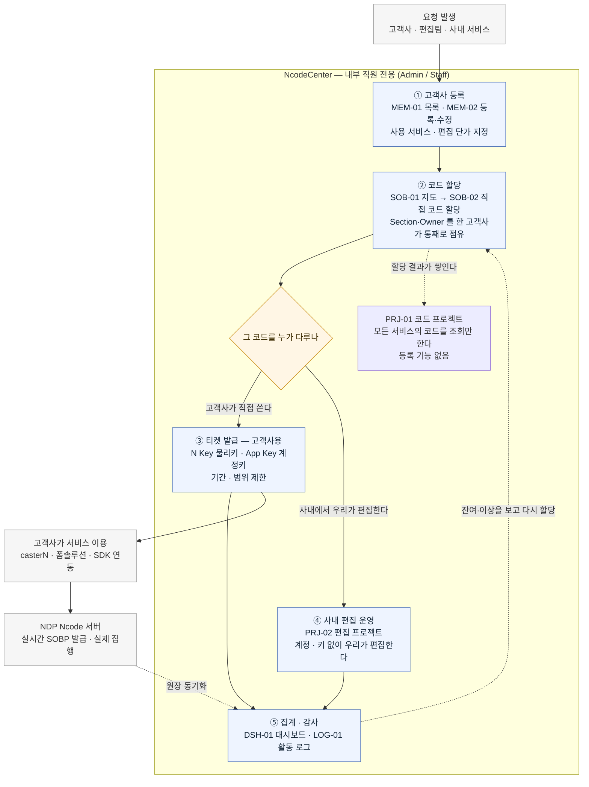
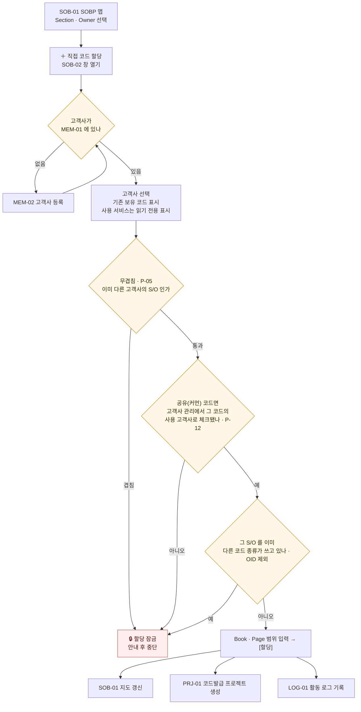
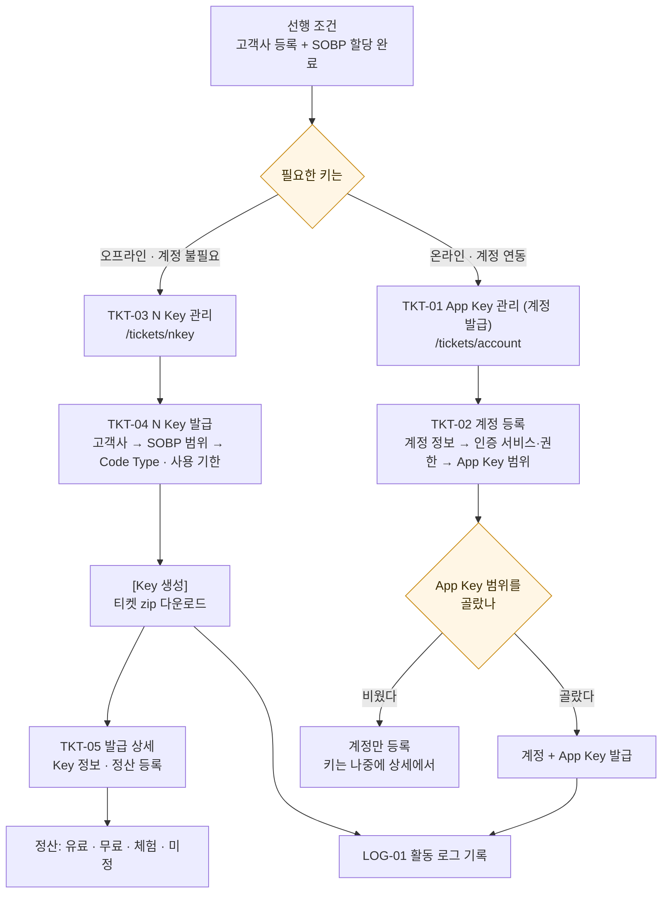
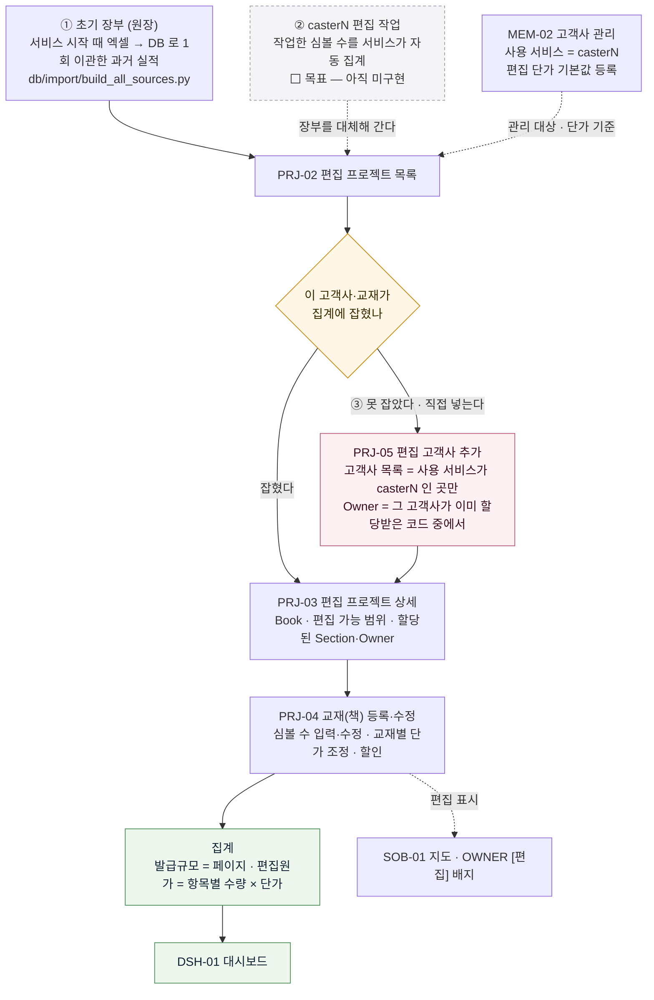
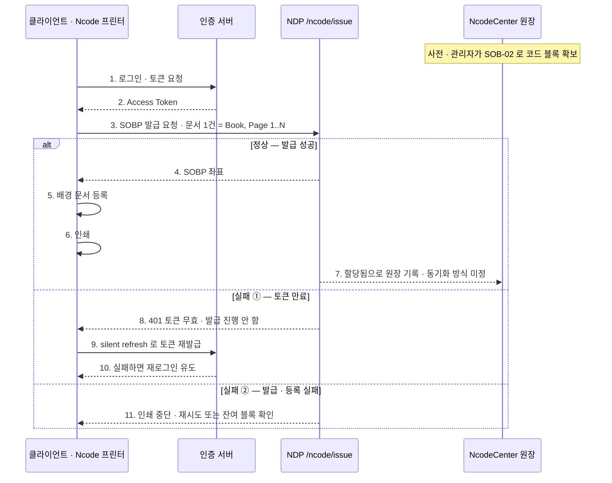
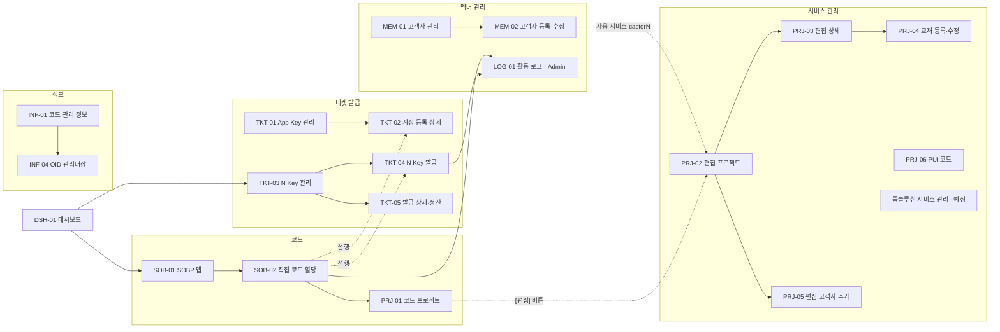

# NcodeCenter — 동작 흐름 (Flow)

> **한 장으로 보는 동작 지도.** ①에서 전체를 보고, ②~⑥에서 각 단계를 펼친다.
> 화면 목록·경로는 [IA](NcodeCenter-IA.md), 화면별 명세는 [PRD](prd/README.md), 규칙 근거는 [운영 정책](NcodeCenter-Operations-Policy.md).
> 정본: 메뉴 = `web/lib/menu.ts` · 라우트 = `web/app/**`.
>
> **Figma 로 옮길 때** — [`NcodeCenter-Flow.html`](NcodeCenter-Flow.html) 을 브라우저로 열고 그림마다 **[SVG 복사]** → Figma 에서 `Ctrl+V`.
> 벡터 그룹으로 들어오고 글자는 편집 가능한 텍스트 레이어다. **이 MD 를 고쳤으면 `python docs/screens/_gen/mkflow.py` 를 다시 돌린다.**

---

## ① 전체 흐름 — 요청에서 사용까지



> **③ 과 ④ 는 배타가 아니다.** 같은 고객사 코드라도 우리가 편집해 주면서(계정 불필요) 동시에 그 고객사에 키를 발급할 수 있다. 갈라지는 건 **누가 그 코드를 다루느냐**다.

**읽는 법 4가지**

| 원칙 | 뜻 |
|---|---|
| 내부 직원만 조작한다 | 고객이 직접 등록·요청하지 않는다. 직원이 대신 등록·할당한다 `PC-002` |
| 주인은 ②에서만 정해진다 | 코드의 소유 고객사가 확정되는 유일한 지점이 `SOB-02` 다 |
| 성격은 ①에서, 종류는 ③에서 | 사용 서비스 = 고객사 속성(`MEM-02`) · 코드 종류 = 발급 시점 지정 `PC-076` `PC-074` |
| **티켓은 고객사용이다** | **사내에서 편집할 때는 계정도 App Key 도 필요 없다** `PC-076`. 티켓은 고객사가 우리 서비스에 로그인하거나 오프라인 툴을 쓸 때만 발급한다 |

## ② 코드 할당 — SOB-01 → SOB-02



- **할당 단위 = S/O**. Owner 전체를 그 고객사가 점유한다. 빈 자리가 남아도 다른 프로젝트가 재활용하지 않는다 `P-07`.
- **연속성**: 연속 페이지가 모자라면 **book 을 분리**하고 book 안에서만 page 를 잇는다. 조각을 합치지 않는다.
- **자동 추천 없음** `PC-028` — 발급 좌표는 사람이 `SOB-01` 에서 고른다.

---

## ③ 티켓 발급 — N Key / App Key 두 갈래

> **사내 편집은 이 화면과 무관하다** — 우리가 편집하는 데는 계정도 키도 필요 없다 `PC-076`. 아래는 **고객사가 코드를 직접 쓸 때**의 흐름이다.



| 구분 | N Key | App Key |
|---|---|---|
| 성격 | 물리 키 — 오프라인 Caster lite | 계정 연동 키 — 온라인 · SDK |
| 계정 | 필요 없다 | 계정이 있어야 발급된다 |
| 관리 화면 | `TKT-03` 목록 → `TKT-04` 발급 → `TKT-05` 상세 | `TKT-01` 목록 → `TKT-02` 등록·상세 |
| 공통 | 이미 **할당된 범위 안에서만** 발급 · 기간(Valid Until)과 Book/Page 로 한도 지정 | |

---

## ④ CasterN 편집 프로젝트 — 편집량은 어디서 오나



### 편집량이 들어오는 경로 3가지

| # | 경로 | 지금 | 앞으로 |
|---|---|---|---|
| ① | **초기 장부(원장)** — 편집팀 엑셀을 DB 로 옮긴 과거 실적 | 유일한 자동 출처 | **1회성 시드로 끝난다.** 이후 갱신하지 않는다 |
| ② | **casterN 자동 집계** — 편집 작업하면 심볼 수가 그대로 올라온다 | ⬜ **미구현** | **주 출처가 된다** — ①을 대체 `P-18` |
| ③ | **직접 등록** — `PRJ-05` 고객사 · `PRJ-04` 교재 | 장부에 없는 건 손으로 넣는다 | ②가 못 잡는 예외만 보완 |

- **① 은 엑셀 빌드가 맞다.** `[데이터확인용]NcodeCenter_편집현황` 을 `build_all_sources.py` 가 읽어 `web/data/editing-detail.json` 으로 굽는다. **빌드 시점에 값이 박히는 정적 스냅샷**이라 서비스가 돌아도 스스로 늘지 않는다 — 그래서 초기 1회 이관용이다.
- **② 가 들어오면 손으로 넣는 일이 사라진다.** 지금은 `PRJ-04` 에서 심볼 수를 사람이 입력하지만, 자동 집계가 붙으면 그 값이 채워져 올라온다. `PRJ-04` 는 **확인·보정 화면**이 된다.
- **장부에서 온 행은 삭제할 수 없다**(실제 편집 실적). 직접 등록분만 **[신규] 배지 + 삭제** — 등록이 만든 것을 일괄 회수한다 `PC-075`.
- **계정·App Key 는 필요 없다** `PC-076`. 편집은 사내에서 하는 일이라 고객사 로그인 수단과 무관하다.

### 단가 — 3단 구조

| 단 | 어디서 | 무엇 |
|---|---|---|
| 1 | 전사 기본 단가 | 적용 500 · 편집 1,000 (정책 `P-16`) |
| 2 | **`MEM-02` 고객사 관리** | **고객사별 기본값 등록** — 이게 그 고객사의 기준이 된다 |
| 3 | **`PRJ-04` 편집 프로젝트** | **교재별 조정·할인** — 이 건만 다르게 갈 때 여기서 고친다 |

- 교재는 **저장 시점의 단가로 고정**된다. 나중에 고객사 단가를 바꿔도 **기존 교재 청구액은 그대로**다 `PC-027`.
- `PRJ-03` 목록에서는 단가를 고치지 않는다 — 고객사 기본값은 `MEM-02`, 교재별은 `PRJ-04` 다.

## ⑤ 실시간 발급 (NDP 연동) — Ncode 프린터

> 관리자가 ②로 **블록(풀)** 을 잡아 주고, 클라이언트는 그 안에서 **페이지 단위로 소비**한다. 두 경로는 배타가 아니다.
> 상태: 인증 체인 ✅ 구현 / `/ncode/issue` 📋 스펙 미정.



> `alt … else … end` 는 **서로 배타적인 세 갈래**를 묶은 상자다(mermaid·UML 표기). 한 번의 발급 요청은 셋 중 하나로만 끝난다.

| 실패 지점 | 처리 |
|---|---|
| 토큰 무효 | silent refresh → 실패 시 재로그인 |
| SOBP 발급 실패 | **인쇄 중단** · 재시도 / 잔여 블록 확인 |
| 배경 문서 등록 실패 | **인쇄 중단**(기본) — 미등록 종이는 필기 매칭 불가 |
| 실프린터 출력 실패 | 등록 유지 · **같은 SOBP 로 재인쇄** |
| 발급 후 미사용 | 회수 정책 **미정** — 협의 항목 |

---

## ⑥ 화면 이동 지도



---

## 정리 — 한 줄 흐름

여기까지가 공통이고,

```
고객사 등록(MEM) → 좌표 점유(SOB)
```

그 다음은 **누가 그 코드를 다루느냐로 갈린다.**

```
고객사가 직접 쓴다  → 키 발급(TKT) → 고객사 서비스 이용 ┐
사내에서 편집한다   → 편집 프로젝트(PRJ) · 계정·키 불필요 ┘ → 집계·감사(DSH · LOG)
```

각 단계의 **선행 조건**만 기억하면 된다.

1. `SOB-02` 할당 전에 **고객사가 등록**돼 있어야 한다.
2. `TKT-04` · `TKT-02` 발급 전에 **SOBP 가 할당**돼 있어야 한다. 단 **사내 편집에는 티켓이 필요 없다** `PC-076`.
3. `PRJ-02` 편집 관리 대상이 되려면 고객사 **사용 서비스 = casterN** 이어야 한다.
4. 편집 데이터를 **장부가 못 잡으면** `PRJ-05`(고객사) · `PRJ-04`(교재) 로 **직접 등록·수정**한다.
