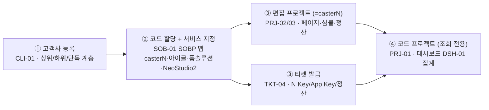
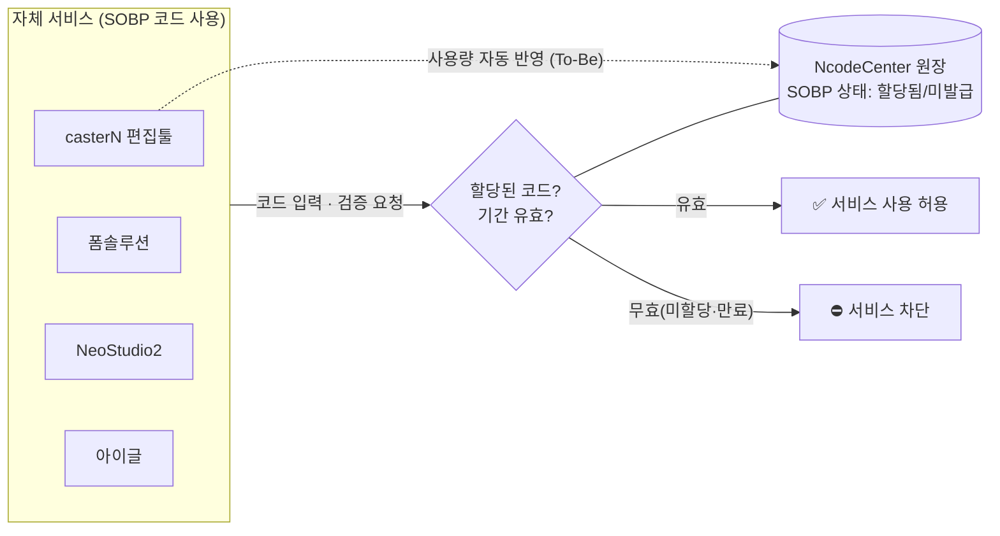

# NcodeCenter 구조 · 기능 정리 (개발팀 리뷰용)

> PPT 제작 전 내용 정리 문서. **목적 · 데이터 흐름**뿐 아니라, 개발팀이 만든 **Web Caster Admin**과의 **동일점 / 차이점**을 함께 정리한다.
> 정본: 메뉴 `web/lib/menu.ts` · 라우트 `web/app/**` · 화면 ID는 [NcodeCenter-IA.md](NcodeCenter-IA.md) 기준.

---

## 1. 시스템 개요

NcodeCenter는 **Ncode(SOBP 코드)의 상태를 관리하는 중추 시스템**이다. 기능적으로는 개발팀의 **Web Caster Admin**(`ndp-dev.neolab.net:14443`, NDP Ncode 서버 프록시)과 유사하며, 여기에 **관리·정산·관제**를 위한 기능을 얹었다.

### 목적 1 — 업무 효율화 (관리·정산)
- 엑셀로 관리하던 **고객사 · 편집 프로젝트 상황 · SOBP 맵 할당 상태**를 검색 가능한 화면으로 통합.
- **편집팀**뿐 아니라 **사업부 · 재무팀**도 확인 → 고객사 관리와 **정산 관리**에 활용.

### 목적 2 — 코드 관제 (제어·자동화)
- casterN · 폼솔루션 등 **SOBP 코드를 쓰는 자체 서비스**의 사용 내역을 자동 확인.
- **할당된 코드 외 입력 · 기간 만료 시 서비스 사용 차단**.
- 할당 코드의 사용을 **자동 반영**(현재 편집 프로젝트 수동 입력 → 향후 casterN 자동).

---

## 2. Web Caster Admin과의 관계 — 한눈에

NcodeCenter는 **Admin의 기능을 계승**하되, 목적 1·2를 위해 **① 활동 로그 ② SOBP 맵 필터링(API) ③ 정산/금액 ④ 신규 관리 화면**을 추가했다.

```
Web Caster Admin (기존)              NcodeCenter (신규)
────────────────────────           ─────────────────────────────
Ticket 발급              ───────▶   티켓 발급            (계승 + 정산/금액)
User 관리 (계정+AppKey)  ───┐
Company 관리             ───┴───▶   고객사 관리          (계승 · 통합)
Ncode 예약 + List        ───┐
Ncode 할당 + List        ───┴───▶   SOBP 맵 · 코드 프로젝트 (계승 + 필터링 API)
Ncode Info               ───────▶   코드 관리 정보           (계승)
                                    ─────────────────────────────
                          (신규)    대시보드
                          (신규)    편집 프로젝트 (편집량·정산)
                          (신규)    PUI 코드
                          (추가)    활동 로그
```

---

## 3. 메뉴 매핑표 (Admin ↔ NcodeCenter)

| Web Caster Admin | NcodeCenter (화면 ID) | 관계 | 비고 |
|------------------|----------------------|------|------|
| **Ticket 발급** | 티켓 발급 (`TKT-04`) | 🟰 동일 계승 | N Key · **계정+App Key**(`TKT-04-2`) · 발급목록에 **정산/금액** 추가 |
| **User 관리** | 고객사 관리 (`CLI-01`) | 🟰 동일(통합) | Admin의 User = **계정이 필요한 대상** → 원래 Company에 넣으면 될 것을 분리했던 것. NcodeCenter는 고객사로 **통합(정상화)** |
| **Company 관리** | 고객사 관리 (`CLI-01`) | 🟰 동일 | User 관리와 함께 **고객사 관리 한 곳으로 통합** |
| **Ncode 예약 + List** | (없음) | ➖ 미채택 | NcodeCenter는 **"예약"을 메뉴로도, 상태로도 두지 않음** — 예약/사용중 구분 폐기 (PC-003·PC-004) |
| **Ncode 할당 + List** | SOBP 맵 (`SOB-01`) · 코드 프로젝트 (`PRJ-01`) | 🟰 계승 **+ 확장** | 고객사 중심 조회. **필터링은 NcodeCenter가 구현, Admin엔 없음 → 개발팀 반영 필요**(§5-2) |
| **Ncode Info** | 코드 관리 정보 (`INF-01`) | 🟰 동일 | 섹션표 · 발급구조 · 가이드(탭 통합) |
| — | **대시보드 (`DSH-01`)** | 🆕 신규 | 사용/예약/업체 집계 요약 |
| — | **편집 프로젝트 (`PRJ-02/03`)** | 🆕 신규 | 편집량(페이지·심볼) + **정산(금액)** |
| — | **PUI 코드 (`PUI-01`)** | 🆕 신규 | 피지컬 기능표 참조 |
| — | **활동 로그 (`LOG-01`)** | ➕ 추가 | 내부 직원 audit (Admin 전용) |
| — | 브랜드(`BRD-01`) · DB 구조(`DBS-01`) | 🆕 신규 | 내부 참조용 |

범례: 🟰 동일 계승 · ➕ 추가 · 🆕 신규 화면 · ➖ 미채택(Admin엔 있으나 우리는 안 씀)

---

## 4. 동일한 점 (Admin 계승)

Admin에서 이미 검증된 아래 기능은 **개념·역할 그대로 계승**한다.

1. **티켓 발급** — 사용자/고객 대상 코드 티켓 발급 및 발급 이력 조회. (NDP 발급 로직 위임)
2. **코드 예약 · 할당** — Section·Owner·Book·Page 체계의 코드 예약/할당. NcodeCenter에서는 **SOBP 맵**으로 시각화.
3. **고객(User) · 회사(Company) 관리** — 계정(App Key)이 부여된 고객 = 고객사. NcodeCenter는 **고객사 관리 한 화면**으로 통합.
4. **Ncode Info** — 섹션/코드 체계 참조 정보.

> **User 관리 해석**: Admin의 `User 관리`는 **계정이 필요한 대상(user)** 을 뜻한다. 실은 **Company(고객사)에 등록하면 될 것을 굳이 별도 메뉴로 분리**했던 것이다. NcodeCenter는 이를 **고객사 관리(CLI-01) 한 곳으로 통합(정상화)** 했다 — 계정(App Key) 부여는 티켓 발급의 `계정 + App Key`(TKT-04-2)에서 처리.

---

## 5. 달라진 / 추가된 점 (핵심)

> **관점**: 아래 항목은 **NcodeCenter(프로토타입)에는 구현돼 있으나 개발팀 Admin에는 없는** 것들이다.
> 즉, **개발팀이 실 서비스(Admin/NDP)에 반영해야 할 항목**으로 이해하면 된다. (구현 주체 ≠ 반영 주체)

| 항목 | NcodeCenter | Admin(개발팀) | 필요 조치 |
|------|:-----------:|:-------------:|-----------|
| 활동 로그 | ✅ 구현 | ❌ 없음 | 개발팀 반영 필요 |
| SOBP 맵 필터링(5종) | ✅ 구현(화면) | ❌ 없음 | **API/백엔드 지원 추가** 필요 |
| 정산(금액) | ✅ 구현 | ❌ 없음 | 개발팀 반영 필요 |

### ➕ 5-1. 활동 로그 (LOG-01) — 신규
- 내부 직원의 **업체 등록 · 코드 할당 · 티켓 발급 · 삭제** 등 주요 행위를 기록.
- 월별 audit 조회. **관리자(ADMIN) 전용** 노출.
- 목적: 다부서(편집·사업·재무) 공동 사용 시 **변경 이력 추적**.

### ➕ 5-2. SOBP 맵 필터링 조건 — NcodeCenter 구현 / Admin 반영 필요
NcodeCenter 화면에는 아래 5종 필터가 **이미 구현**돼 있다. 다만 **개발팀 Admin에는 이 필터가 없으므로**, 실 연동 시 **NDP/Ncode API가 아래 상태를 구분·필터**할 수 있도록 개발팀이 추가해야 한다.

| 화면 필터 | 의미 | 상태색 |
|-----------|------|--------|
| **발급 전체** | 발급(할당)된 코드 전체 (편집·공유·사용가능 포함) | — |
| **코드 미발급** | 아직 발급되지 않은 빈 코드 | 회색 |
| **편집** (발급 중 편집코드) | 발급된 코드 중 편집에 쓰인 코드 | 파랑 |
| **공유** (공유코드) | 여러 고객사가 함께 쓰도록 지정된 Owner | 보라 |
| **사용가능** | 공유(커먼) 코드 중 **아직 편집하지 않은** 코드 | 주황 |

> 요약: `발급전체 / 코드 미발급 / 편집 / 공유 / 공유 중 미사용(=사용가능)` 5종 상태를 API 응답에서 구분·필터할 수 있어야 한다.

### ➕ 5-3. 정산 기능 (금액) — 신규
- **편집 프로젝트**에 편집량(페이지·심볼)뿐 아니라 **금액(청구액)** 을 추가.
- **3단 단가 구조**로 정산:
  1. **기본(표준) 단가** — PDF 페이지 500원 / 심볼 편집 1,000원
  2. **고객사 단가** — 고객사 관리에서 기본 단가를 고쳐 저장
  3. **프로젝트 단가·할인** — 교재(책)별 단가 조정 + 할인율/할인액
- `청구액 = (페이지×페이지단가 + 심볼×심볼단가) × (1−할인율) − 추가할인액`
- 재무팀이 **고객사별 청구액 · 기준가 · 할인액**을 바로 확인.

### 🆕 5-4. 신규 관리 화면
- **대시보드(DSH-01)** — 소유권·사용중·예약·업체 수 집계 요약.
- **편집 프로젝트(PRJ-02/03)** — 편집량·정산 관리 (위 5-3).
- **PUI 코드(PUI-01)** — 피지컬 기능표 참조.

---

## 6. 기능 흐름도 (목적 1 대응)

엑셀 데이터를 **업무 순서**에 맞춰 화면 기능으로 재구성.



**활용 주체**: 편집팀(casterN 작업·편집원가) · 사업부(고객사 계층·할당 현황) · 재무팀(정산·단가).
**서비스 지정은 SOBP 맵 코드 할당에서만**(PC-011), 코드 프로젝트는 조회·검색 전용.

---

## 7. 데이터 흐름도 (목적 2 대응)

SOBP 코드를 쓰는 자체 서비스와 연동 — 코드 검증 + 사용량 자동 반영.



**사용량 반영 — 수동에서 자동으로**
- **AS-IS (현재)**: casterN 작업 → 사람이 사용량 확인 → **편집 프로젝트에 수동 입력**.
- **TO-BE (목표)**: casterN 작업 → **API 자동 전송** → **NcodeCenter 원장 자동 반영**(수동 입력 없음).

---

## 8. PPT 반영 항목 (체크리스트)

- [ ] 목적 1·2 (기존 유지)
- [ ] **Admin ↔ NcodeCenter 매핑표** (§3) — 슬라이드 1장
- [ ] **동일점 / 추가·차이점** (§4~5) — 슬라이드 1~2장
- [ ] SOBP 맵 필터링 5종 (API 요건) — 표
- [ ] 정산 3단 단가 구조 — 도식
- [ ] 기능 흐름도 · 데이터 흐름도 (기존 유지)
